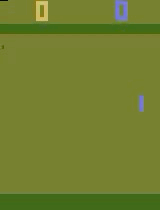

# Proximal Policy Optimization

This repo contains Python implementation of Proximal Policy Optimization algorithm [[1]](#references). It is tested on 2 tasks, one employing continuous and one - discrete policy. Actor models in both tasks used combinations of convolutional(CNN) and fully connected layers and parametrize some random distributions which are used for policies.

# Car Racing

The task is to control a car in 2D enviroment by providing it with a vector of 3 continuous values: steering angle, gas and breaking. On practice gas and breaking are merged into one value, i.e. actor either adds gas or breaks, following the logic described in [[6]](#references). As a result the policy is modelled by 2D diagonal Gaussian distribution, whose means vector is parametrized by actor and standard deviations are linearly interpolated between 2 predefined constant values in logspace throughout the training. As input information the actor receives 4 last grayscale frames of the game. The trained actor reached mean-100-games score of 802. 

# Pong

The task is a classic Atari game of ping pong. Actor controls its pad by either moving it up or down. The probability of movement is modelled by Bernoulli distribution whose logit is predicted by the actor model. As input the actor receives the difference of 2 last grayscale game frames. Trained actor obtained mean-100-games score of 20.86.

The recording shows trained actor playing in enviroment with low probability of repeating its last action. This introduces noise and makes game more dynamic, as actor has to sometimes correct for unexpected moves of his pad.

# References

[1] Schulman J. et al., "Proximal Policy Optimization Algorithms", [https://arxiv.org/pdf/1707.06347](https://arxiv.org/pdf/1707.06347)

[2] Schulman J. et al., "High-Dimensional Continuous Control Using Generalized Advatntage Estimation", [https://arxiv.org/pdf/1506.02438](https://arxiv.org/pdf/1506.02438)

[3] Berkeley RL Bootcamp, [https://www.youtube.com/playlist?list=PLAdk-EyP1ND8MqJEJnSvaoUShrAWYe51U](https://www.youtube.com/playlist?list=PLAdk-EyP1ND8MqJEJnSvaoUShrAWYe51U)

[4] Gymnasium Documentation, [https://gymnasium.farama.org/index.html](https://gymnasium.farama.org/index.html)

[5] OpenAI spinning up in Deep RL, [https://spinningup.openai.com/en/latest/](https://spinningup.openai.com/en/latest/)

[6] Petrazzini I. and Antonelo E., "Proximal Policy Optimization with Continuous Bounded Action Space via the Beta Distribution", [https://arxiv.org/pdf/2111.02202](https://arxiv.org/pdf/2111.02202)

[7] Going Deeper Into Reinforcement Learning: Fundamentals of Policy Gradients, [https://danieltakeshi.github.io/2017/03/28/going-deeper-into-reinforcement-learning-fundamentals-of-policy-gradients/](https://danieltakeshi.github.io/2017/03/28/going-deeper-into-reinforcement-learning-fundamentals-of-policy-gradients/)
